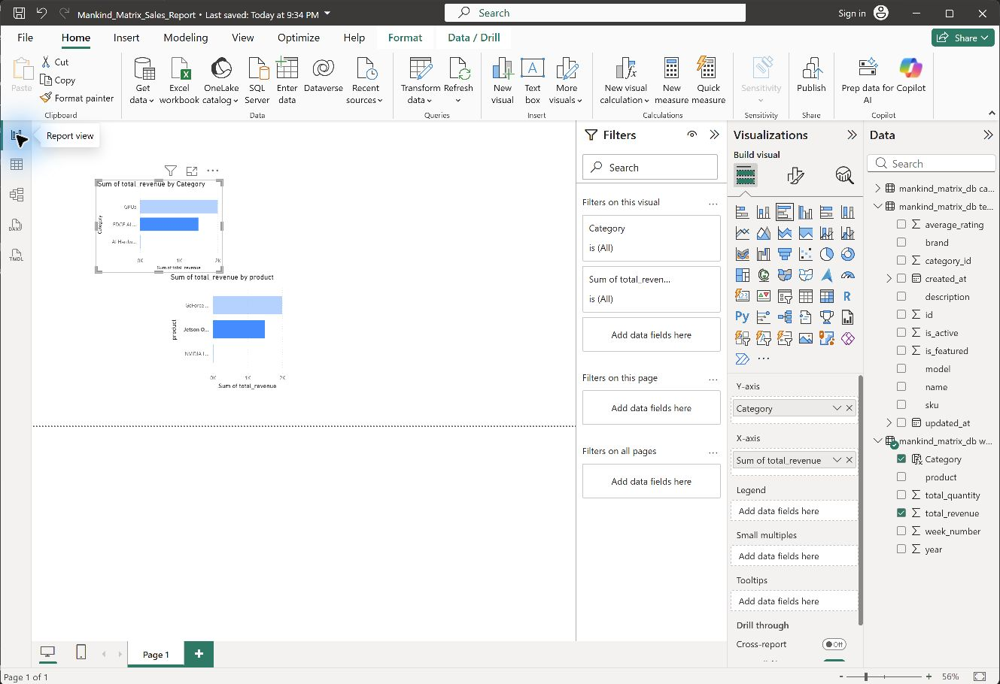

# Mankind Matrix Power BI Sales Report

Power BI analysis of weekly product sales from the `mankind_matrix_db` Aiven MySQL database.



## Executive summary

- Total sales revenue: **$3,523.47**
- Total quantity sold: **4 units**
- Products represented: **3**
- Top product: **GeForce RTX 4070 Family**, generating **$1,999.98** (56.76% of revenue)
- Top category: **GPUs**, generating **$1,999.98** (56.76% of revenue)

## Top-selling products

| Rank | Product | Category | Quantity | Revenue | Revenue share |
|---:|---|---|---:|---:|---:|
| 1 | GeForce RTX 4070 Family | GPUs | 2 | $1,999.98 | 56.76% |
| 2 | Jetson Orin Nano Super Developer Kit | EDGE AI COMPUTING | 1 | $1,499.99 | 42.57% |
| 3 | NVIDIA L4 GPU | AI Hardware | 1 | $23.50 | 0.67% |

## Top-selling categories

| Rank | Category | Quantity | Revenue | Revenue share |
|---:|---|---:|---:|---:|
| 1 | GPUs | 2 | $1,999.98 | 56.76% |
| 2 | EDGE AI COMPUTING | 1 | $1,499.99 | 42.57% |
| 3 | AI Hardware | 1 | $23.50 | 0.67% |

## Power BI implementation

The report contains horizontal bar charts ranking revenue by product and category. The calculated category column maps the weekly sales product through the product master into the category table:

```DAX
Category =
VAR CategoryId =
    LOOKUPVALUE(
        'mankind_matrix_db test_products'[category_id],
        'mankind_matrix_db test_products'[name],
        [product]
    )
RETURN
    LOOKUPVALUE(
        'mankind_matrix_db category'[name],
        'mankind_matrix_db category'[id],
        CategoryId
    )
```

## Files

- `Mankind_Matrix_Sales_Report.pbix` — editable Power BI Desktop report
- `dashboard-preview.jpg` — dashboard preview
- `sales-summary.csv` — reproducible sales summary

## Refreshing the report

1. Open the `.pbix` file in 64-bit Power BI Desktop.
2. Select **Home > Refresh**.
3. If prompted, choose **Database** authentication and enter an authorized MySQL username and password.
4. Never commit database passwords, `.env` files, certificate private keys, or credential caches.

## Data note

This sample contains three weekly-sales rows. The rankings demonstrate the reporting workflow and should not be interpreted as a long-term business trend.
